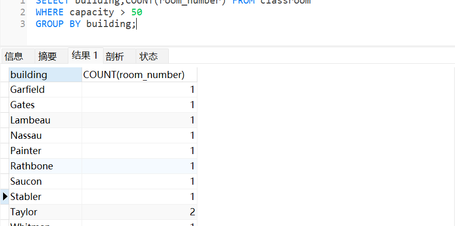
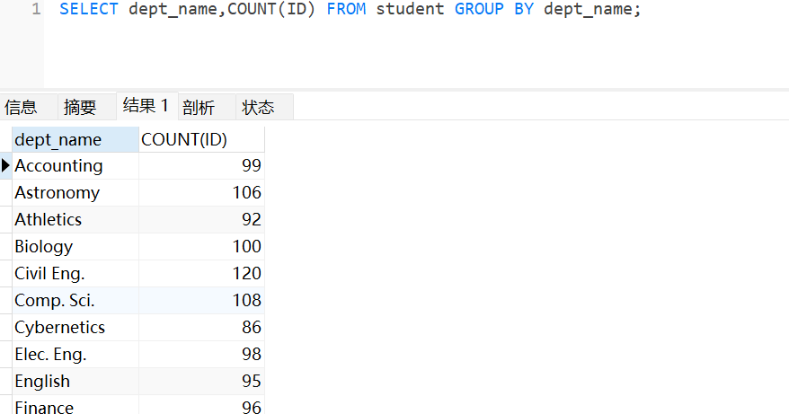
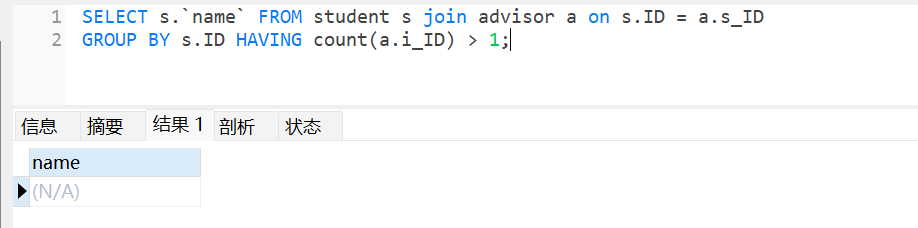
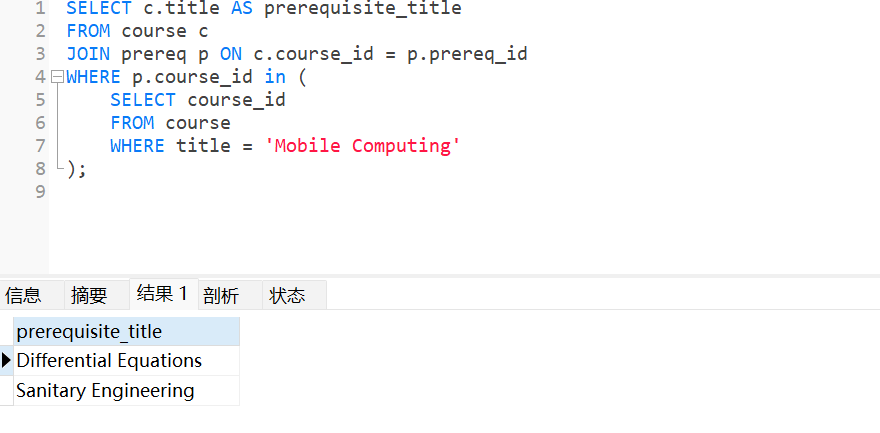
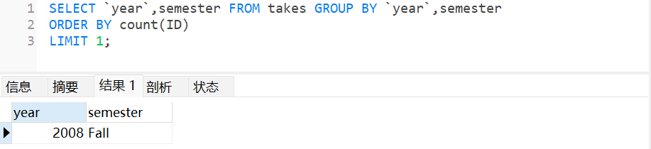

## 华东师范大学软件工程学院实验报告

| 实验课程：数据库实践      | 姓名：黄凯勋            | 学号：10235101576 |
| ----------------------------- | -------------------- | ---------------- |
| 实验名称：SQL-Homework-Lab01 | 实验日期：2025.3.18 | 指导老师：姚俊杰 |

----

*based on database activity*
### Question 0: Give me the number of faculty members who participate in an activity  (easy)

### Question 1: How many activities do we have?  (easy)

### Question 2: How many faculty members does each building have? List the result with the name of the building.  (medium)

### Question 3: How many activities does Mark Giuliano participate in?  (medium)

### Question 4: Show the ids of the faculty who don't participate in any activity.  (hard)

### Question 5: What are the ids of the faculty members who do not advise any student.  (hard)

### Question 6: Find the name of the activity that has the largest number of student participants.  (extra)

### Question 7: What are the first name and last name of Linda Smith's advisor?  (extra)

### Question 8: Give me the the first and last name of the faculty who advises the most students.  (extra)

### Question 9: Find the ids of the students who participate in Canoeing and Kayaking.  (extra)

### Question 10: List the names of all courses ordered by their titles and credits.  (easy)

### Question 11: Count the number of students who have advisors.  (easy)

### Question 12: How many departments offer courses?  (easy)

### Question 13: List the information of all instructors ordered by their salary in ascending order.  (easy)

### Question 14: How many different courses offered by Physics department?  (easy)

### Question 15: What are the titles for courses with two prerequisites?  (medium)

### Question 16: What is the title, credit value, and department name for courses with more than one prerequisite?  (medium)

### Question 17: Give the title of the course offered in Chandler during the Fall of 2010.  (medium)

### Question 18: List the names and buildings of all departments sorted by the budget from large to small.  (medium)

### Question 19: Find the names and average salaries of all departments whose average salary is greater than 42000.  (medium)

### Question 20: Find the number of rooms with more than 50 capacity for each building.  (medium)

### Question 21: Find the total number of students in each department.  (medium)

### Question 22: How many rooms whose capacity is less than 50 does the Lamberton building have?  (medium)

### Question 23: What are the names of students who have more than one advisor?  (medium)

### Question 24: Find the department name of the instructor whose name contains 'Soisalon'.  (medium)

### Question 25: Give the name of the department with the lowest budget.  (medium)

### Question 26: What is the title of the course that is a prerequisite for Mobile Computing?  (hard)

### Question 27: What are the names of the 3 departments with the most courses?  (hard)

### Question 28: Find the id of the courses that do not have any prerequisite?  (hard)

### Question 29: What are the names of students who took a course in the Fall of 2003?  (hard)

### Question 30: Find the semester and year which has the least number of student taking any class.  (hard)

### Question 31: Find the id of instructors who didn't teach any courses?  (hard)

### Question 32: Find the name of students who took some course offered by Statistics department.  (hard)

### Question 33: What are the titles of courses without prerequisites?  (hard)

### Question 34: Find names of instructors with salary greater than that of some (at least one) instructor in the Biology department.  (hard)

### Question 35: How many instructors are in the department with the highest budget, and what is their average salary?  (hard)

### Question 36: What are the names of students who haven't taken any Biology courses?  (hard)

### Question 37: Give the title of the prerequisite to the course International Finance.  (hard)

### Question 38: What is the name of the department with the most credits?  (hard)

### Question 39: Give the name and building of the departments with greater than average budget.  (extra)
