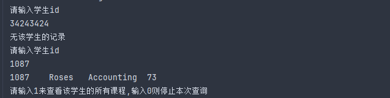
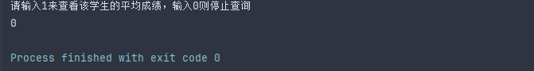
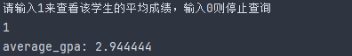

## 华东师范大学软件工程学院实验报告

| 实验课程：数据库实践      | 姓名：黄凯勋            | 学号：10235101576 |
| ----------------------------- | -------------------- | ---------------- |
| 实验名称：SQL-Homework-Lab02 | 实验日期：2025.3.28 | 指导老师：姚俊杰 |
### 实验目标
- 使用编程语言连接数据库并实现批量化插入删除查询等功能。
- 注意事项：本次实验不限定编程语言，但仅提供windows环境下的java用例，如果使用其他环境或其他语言连接亦可，我们更推荐使用java(JDBC)或c++(ODBC)，想要选用其他语言的同学需自行查阅相关语言的数据库连接文档。

### 实验要求
小项目作业：
- 1. 连接SQL(实验报告1)中使用的college数据库。
- 2. 现在，你就是学校信息系统的程序员，使用JDBC编写程序，完成以下任务：
	2.1 通过输入的登陆ID和密码，开启与数据库的连接
	2.2连接成功后，要求用户输入一个字符串。返回所有名字中含有该子串的学生的信息，包括（ID，name，dept_name, tot_cred）4个字段。
	2.3 然后要求用户输入一个整数（0～99999），并显示ID与之完全匹配的的学生的信息，内容要求同上。
    2.4 若2.5中修读课程不为空，则在用户输入1后，计算该学生的计算平均绩点，并显示。
	2.5 若2.3中学生查找成功，则在用户输入1后，输出学生所修读的所有课程信息。包括以下信息：
	   1. 课程ID
		2. 上课年份
		3. 上课学期
		4. 课程名称
		5. 开课院系
		6. 成绩等级
		7. 课程学分数
    
- 3. 以上错误处理要求如下：
	3.1 若2.1连接失败，提示用户错误并允许重试
	3.2 若2.2查询结果为空，提示用户无相关学生并允许重新输入
	3.3 若2.3查询结果为空，提示用户无该学生并允许重试
	3.4 若2.4和2.5中用户输入0，则停止本次查询
	3.5 连接数据库成功后，请捕获所有数据库有关异常并处理，不要抛出停止程序。

### 实验过程记录


#### 测试JDBC连接数据库
1.创建表
```java
    @Test
    public void JDBCCreate() throws Exception {
        String url = "jdbc:mysql://localhost:3306/college";
        String user = "root";
        String password = "123456";
        Connection connection = DriverManager.getConnection(url, user, password);
        Statement statement = connection.createStatement();
        try {
            String sql = "CREATE TABLE employee (id INT," +
                         " name VARCHAR(20) NOT NULL, " +
                            " age INT NOT NULL, " +
                            " address VARCHAR(50), " +
                            " salary REAL, " +
                            "PRIMARY KEY (id))";
            statement.executeUpdate(sql);
        } catch (Exception e){
            System.err.println(e.getClass().getName() + ": " + e.getMessage());
            e.printStackTrace();
        }finally{
            statement.close();
            connection.close();
        }
        System.out.println("Create table successfully");
    }
```

2.插入数据
```java
    @Test
    public void JDBCInsert() throws Exception {
        String url = "jdbc:mysql://localhost:3306/college";
        String user = "root";
        String password = "hkx171901";
        Connection connection = DriverManager.getConnection(url, user, password);
        Statement statement = connection.createStatement();
        try {
            String[] insertSQL = {
                "INSERT INTO employee VALUES (1, 'Gong', 48, '2075 Kongjiang Road', 20000.00 );",
                "INSERT INTO employee VALUES (2, 'Luan', 25, '3663 Zhongshan Road(N)', 15000.00 );",
                "INSERT INTO employee VALUES (3, 'Hu', 23, '3663 Zhongshan Road(N)', 15000.00 );",
                "INSERT INTO employee VALUES (4, 'Jin', 24, '3663 Zhongshan Road(N)', 15000.00 );",
                "INSERT INTO employee VALUES (5, 'Yi', 24, '3663 Zhongshan Road(N)', 15000.00 );"
            };
            for (String sql : insertSQL) {
                statement.executeUpdate(sql);
            }
        } catch (Exception e){
            System.err.println(e.getClass().getName() + ": " + e.getMessage());
            e.printStackTrace();
        }finally {
            statement.close();
            connection.close();
        }
        System.out.println("Insert data successfully");
    }
```

3.查询数据
```java
    @Test
    public void JDBCSelect() throws Exception {
        String url = "jdbc:mysql://localhost:3306/college";
        String user = "root";
        String password = "hkx171901";
        Connection connection = DriverManager.getConnection(url, user, password);
        //为了防止注入攻击使用预编译语句
        PreparedStatement preparedStatement = connection.prepareStatement("select * from employee");
        ResultSet resultSet = preparedStatement.executeQuery();
        try{
            while (resultSet.next()){
                int id = resultSet.getInt("id");
                String name = resultSet.getString("name");
                int age = resultSet.getInt("age");
                String address = resultSet.getString("address");
                double salary = resultSet.getDouble("salary");
                System.out.println(id + " " + name + " " + age + " " + address + " " + salary);
            }
        }catch (Exception e){
            System.err.println(e.getClass().getName() + ": " + e.getMessage());
            e.printStackTrace();
        }finally{
            resultSet.close();
            preparedStatement.close();
            connection.close();
        }
    }
```    

4.更新数据
```java
@Test
    public void JDBCUpdate() throws Exception {
        String url = "jdbc:mysql://localhost:3306/college";
        String user = "root";
        String password = "hkx171901";
        Connection connection = DriverManager.getConnection(url, user, password);
        //为了防止注入攻击使用预编译语句

        try{
            PreparedStatement preparedStatement1 = connection.prepareStatement("UPDATE employee set SALARY = 50000.00 where ID=1;");
            PreparedStatement preparedStatement2 = connection.prepareStatement("select * from employee");
            ResultSet resultSet = preparedStatement2.executeQuery();
            int i = preparedStatement1.executeUpdate();
            if(i < 0){
                System.out.println("Update failed");
            }
            else System.out.println("Update successful");
            while (resultSet.next()){
                int id = resultSet.getInt("id");
                String name = resultSet.getString("name");
                int age = resultSet.getInt("age");
                String address = resultSet.getString("address");
                double salary = resultSet.getDouble("salary");
                System.out.println(id + " " + name + " " + age + " " + address + " " + salary);

                resultSet.close();
                preparedStatement1.close();
                preparedStatement2.close();
            }
        }catch (Exception e){
            System.err.println(e.getClass().getName() + ": " + e.getMessage());
        }finally {
            connection.close();
        }
    }
```

5.删除数据
```java
    @Test
    public void JDBCDelete() throws Exception {
        String url = "jdbc:mysql://localhost:3306/college";
        String user = "root";
        String password = "hkx171901";
        Connection connection = DriverManager.getConnection(url, user, password);
        //为了防止注入攻击使用预编译语句
        try{
            PreparedStatement preparedStatement1 = connection.prepareStatement("DELETE from employee where ID=2;");
            PreparedStatement preparedStatement2 = connection.prepareStatement("select * from employee");
            int i = preparedStatement1.executeUpdate();
            ResultSet resultSet = preparedStatement2.executeQuery();
            if(i < 0){
                System.out.println("delete failed");
            }
            else System.out.println("delete successful");
            while (resultSet.next()){
                int id = resultSet.getInt("id");
                String name = resultSet.getString("name");
                int age = resultSet.getInt("age");
                String address = resultSet.getString("address");
                double salary = resultSet.getDouble("salary");
                System.out.println(id + " " + name + " " + age + " " + address + " " + salary);
                //释放资源
                resultSet.close();
                preparedStatement1.close();
                preparedStatement2.close();
            }
        }catch (Exception e){
            System.err.println(e.getClass().getName() + ": " + e.getMessage());
        }finally {
            connection.close();
        }
    }  
```

因为删除操作使while循环无法继续执行，所以在删除操作后，需要重新查询数据库，并释放资源。

6.pre操作
```java
@Test
    public void JDBCPrepare() throws Exception {
        String url = "jdbc:mysql://localhost:3306/college";
        String user = "root";
        String password = "hkx171901";
        Connection connection = DriverManager.getConnection(url, user, password);
        PreparedStatement preparedStatement1 = connection.prepareStatement("CREATE TABLE IF NOT EXISTS GPA(grade CHAR(2), grade_point DECIMAL(3,2));");
        preparedStatement1.executeUpdate();
        try {
            String[] strArray = new String[11];
            strArray[0] = "A";
            strArray[1] = "A-";
            strArray[2] = "B+";
            strArray[3] = "B";
            strArray[4] = "B-";
            strArray[5] = "C+";
            strArray[6] = "C";
            strArray[7] = "C-";
            strArray[8] = "D";
            strArray[9] = "D-";
            strArray[10] = "F";
            double[] doubleArray = new double[] {4.0,3.7,3.3,3.0,2.7,2.3,2.0,1.5,1.3,1.0,0};
            PreparedStatement preparedStatement2 = connection.prepareStatement("INSERT INTO GPA(grade, grade_point) VALUES (?,?)");
            for(int i = 0;i < 11; i++){
                preparedStatement2.setString(1, strArray[i]);
                preparedStatement2.setBigDecimal(2,BigDecimal.valueOf(doubleArray[i]));
                preparedStatement2.addBatch();
            }
            preparedStatement2.executeBatch();
        }catch (Exception e){
            System.err.println(e.getClass().getName() + ": " + e.getMessage());
        }finally{
            preparedStatement1.close();
            connection.close();
        }
    }
```

#### JDBC小项目作业
java代码如下：
```java
package lab2;
import java.sql.*;
import java.util.Scanner;

public class JDBCProject {
    public static void main(String[] args)  {
        String url = "jdbc:mysql://localhost:3306/college";
        Scanner sc = new Scanner(System.in);
        Connection connection = null;

        while (true) {
            try {
                System.out.println("请输入你的用户名:");
                String user = sc.nextLine();
                System.out.println("请输入你的密码:");
                String password = sc.nextLine();
                connection = DriverManager.getConnection(url, user, password);
                System.out.println("数据库连接成功！");
                break; // 成功连接后退出循环
            } catch (SQLException e) {
                System.err.println("数据库连接失败: " + e.getMessage());
                System.out.println("请重新输入用户名和密码。");
            }
        }//使用循环来实现重新输入的功能

        try {
            //2.2的查询
            while(true) {
                System.out.println("请输入要查询的学生姓名");
                String name = sc.nextLine();
                PreparedStatement prepared = connection.prepareStatement("select ID,name,dept_name,tot_cred from student where name like ? ");
                String input = "%" + name + "%";
                prepared.setString(1, input);//为占位符赋值,同时实现模糊查询
                ResultSet resultSet = prepared.executeQuery();
                if (!resultSet.next()) {
                    System.out.println("无该学生信息");
                    continue;
                }
                //输出学生信息
                do {
                    int sid = resultSet.getInt(1);
                    String sname = resultSet.getString(2);
                    String dname = resultSet.getString(3);
                    int tot = resultSet.getInt(4);
                    System.out.println(sid + "\t" + sname + "\t" + dname + "\t" + tot);
                } while (resultSet.next());
                resultSet.close();
                prepared.close();
                break;

            }
            //2.3的查询
            Boolean tag = true;
            label1:
            while(tag) {
               System.out.println("请输入学生id");
               int id = sc.nextInt();
               sc.nextLine();
               PreparedStatement prepared2 = connection.prepareStatement("select * from student where id = ? ");
               prepared2.setInt(1, id);
               ResultSet resultSet2 = prepared2.executeQuery();
               if(!resultSet2.next()) {
                System.out.println("无该学生的记录");
                continue;
                }
               else{
                do {
                int sid= resultSet2.getInt(1);
                String sname = resultSet2.getString(2);
                String dname = resultSet2.getString(3);
                int tot = resultSet2.getInt(4);
                System.out.println(sid + "\t" + sname + "\t" + dname + "\t" + tot);
                }  while (resultSet2.next());
                resultSet2.close();
                prepared2.close();
            

                //2.4的查询
                System.out.println("请输入1来查看该学生的所有课程,输入0则停止本次查询");
                int key1 = sc.nextInt();
                sc.nextLine();
                if (key1 == 1) {
                    PreparedStatement prepared3 = connection.prepareStatement(
                            "SELECT t.course_id, t.year, t.semester, c.title, c.dept_name, t.grade, c.credits " +
                                    "FROM takes t " +
                                    "JOIN course c ON t.course_id = c.course_id " +
                                    "WHERE t.id = ?"
                    );
                    prepared3.setInt(1,id);
                    ResultSet resultSet3 = prepared3.executeQuery();
                    while (resultSet3.next()) {
                        int tid= resultSet3.getInt("course_id");
                        int year= resultSet3.getInt("year");
                        String semester= resultSet3.getString("semester");
                        String title= resultSet3.getString("title");
                        String deptName= resultSet3.getString("dept_name");
                        String grade= resultSet3.getString("grade");
                        int credits= resultSet3.getInt("credits");
                        System.out.printf("%d\t%d\t%s\t%s\t%s\t%s\t%d\n", tid, year, semester, title, deptName, grade, credits);
                    }
                    resultSet3.close();
                    prepared3.close();
                

                     //2.5的查询
                    System.out.println("请输入1来查看该学生的平均成绩，输入0则停止查询");
                    int key2 = sc.nextInt();
                    sc.nextLine();
                    if (key2 == 1) {
                        PreparedStatement prepared4 = connection.prepareStatement("SELECT " + " AVG(g.grade_point) AS average_gpa " + " FROM" + " takes t " +
                                " JOIN " + " gpa g ON t.grade = g.grade " + " WHERE " + " t.id = ?; ");
                        prepared4.setInt(1,id);
                        ResultSet resultSet4 = prepared4.executeQuery();
                        while (resultSet4.next()) {
                            Double gpa= resultSet4.getDouble("average_gpa");
                            System.out.println("average_gpa: "+gpa);
                        }
                        tag = false;
                        resultSet4.close();
                        prepared4.close();
                    }
                    else if (key2 == 0) {
                        tag = false;
                        break label1;
                    }

                }
                else if (key1 == 0) {
                    tag = false;
                    break label1;
                }

            }
            }

            // 关闭连接
            if (connection != null) {
                connection.close();
            }

        } catch (Exception e) {
            System.err.println("数据库异常: " + e.getMessage());
        } finally {
            // 关闭Scanner对象
            if (sc != null) {
                sc.close();
            }
        }
    }
}
```
- 功能实现
- 2.1
输入用户名和密码，错误时重新输入

- 2.2
输入学生姓名，模糊查询，输出学生信息，查询不到时提示无该学生信息，并且继续查询

- 2.3
输入学生id，查询学生信息，查询不到时提示无该学生的记录，并且继续查询

- 2.4
输入0停止查询

输入1查看该学生的所有课程

- 2.5
输入0停止查询

输入1查看该学生的平均成绩


### 实验结论
- 实现了JDBC的增删改查操作，并通过预编译语句防止SQL注入攻击。
- 实现了JDBC的事务处理，通过try-catch-finally来实现事务的提交、回滚和关闭。
- 实现了JDBC的连接池，通过连接池来实现数据库连接的复用，提高数据库连接的效率。
- 通过这次实验，对JDBC的使用有了更深入的理解，掌握了JDBC的相关知识。