## 华东师范大学软件工程学院实验报告

| 实验课程：数据库实践      | 姓名：黄凯勋            | 学号：10235101576 |
| ----------------------------- | -------------------- | ---------------- |
| 实验名称：SQL-Homework-Lab03 | 实验日期：2025.4.16 | 指导老师：姚俊杰 |
### 实验目标
1.学习mysql explain语句
2.学会解释计划查询
3.学会画查询计划树
### 实验要求
1.按照实验内容，依次完成每个实验步骤；
2.操作实验步骤时，需要理解该操作步骤的目的，预判操作的结果；当操作结果与预判不符时，及时向任课教师和助教咨询；
3.在实验报告中依次记录主要操作步骤的内容和结果（返回的消息或截图）；
4.对实验中遇到的问题、解决方案及收获进行总结；
5.确保实验报告整洁、美观（注意字体、字号、对齐、截图大小和分页等；）
### 实验过程记录
#### 步骤1
连接数据库 college
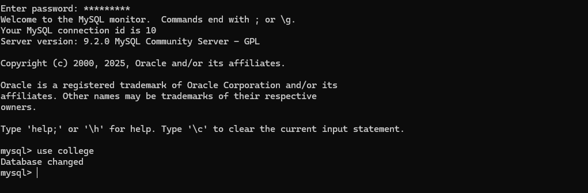
#### 步骤2
执行计划查询和解释

##### 1.执行一下语句，获取并解释该查询的执行计划：
```sql
EXPLAIN SELECT title FROM course ORDER BY title, credits;
```
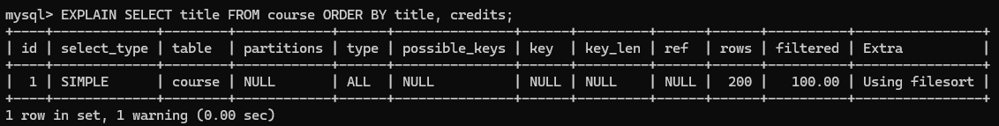
```sql
EXPLAIN FORMAT=TREE SELECT title FROM course ORDER BY title, credits;
```
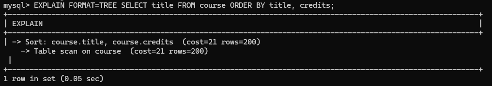
图片表示1.首先查询的动作会是对course表进行全表扫描，其中成本cost=21，行数rows=200行。
```sql
EXPLAIN analyze SELECT title FROM course ORDER BY title, credits;
```
```sql
EXPLAIN analyze SELECT title FROM course ORDER BY title, credits;
```
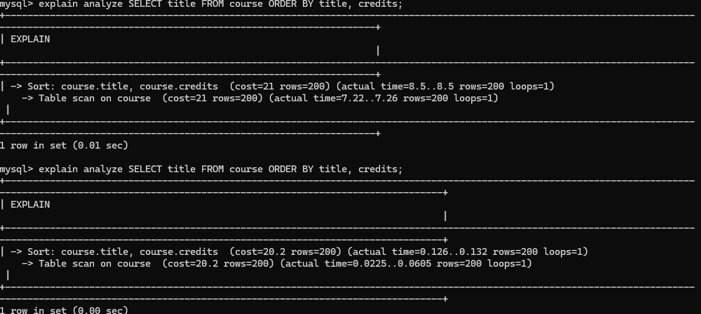
根据结果，先进行全表查询，然后对结果排序。
第一次全表扫描耗时actual time=10.4，读取行数rows=200，循环loops=1

第二次全表扫描耗时actual time=0.0284，读取行数rows=200，循环loops=1

第一次排序耗时actual time=11.6，读取行数rows=200，循环loops=1

第二次排序耗时actual time=0.208，读取行数rows=200，循环loops=1

说明：两次查询的开销从21到20.2，开销变小，第一次执行后某些数据被缓存在内存中，那么第二次执行时可能会更快地访问这些数据

##### 2.执行一下语句，获取并解释该查询的执行计划：
```sql
explain SELECT T1.name FROM student  T1 
JOIN advisor  T2 ON T1.id = T2.s_id 
GROUP BY T2.s_id HAVING count(*) > 1;
```
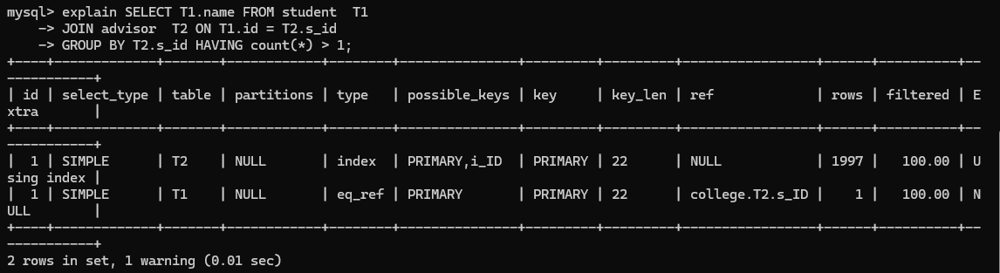
第一行 (id=1) 是对 T2 表的查询，使用 index 类型，表示使用了索引进行扫描。可能的索引是 PRIMARY 和 _ID，实际使用的索引是 PRIMARY。预计需要检查 2000 行，过滤率为 100%

第二行 (id=1) 是对 T1 表的查询，同样使用 index 类型，可能的索引是 eq_ref，实际使用的索引是 PRIMARY。预计需要检查 1 行，过滤率为 100% 

Id相同，查询顺序从T2到T1

```sql
explain analyze SELECT T1.name FROM student  T1 
JOIN advisor  T2 ON T1.id = T2.s_id 
GROUP BY T2.s_id HAVING count(*) > 1; 
```
```sql
explain analyze SELECT T1.name FROM student  T1 
JOIN advisor  T2 ON T1.id = T2.s_id 
GROUP BY T2.s_id HAVING count(*) > 1;
```
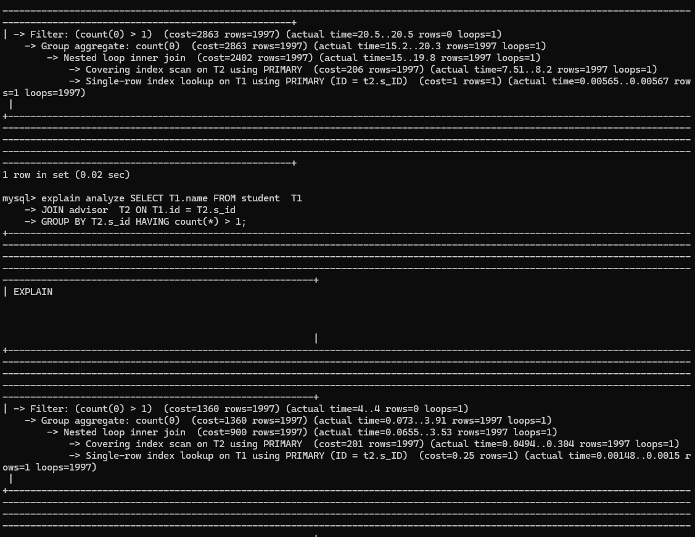
两次查询顺序都是从下往上执行。
1. Single-row index lookup on T1 using PRIMARY (ID = t2.s_ID)
在t1表上进行单行索引查询，显示预估成本和实际耗时以及查询的结果返回行数，循环次数
第一次
 Single-row index lookup on T1 using PRIMARY (ID = t2.s_ID)  (cost=1 rows=1) (actual time=0.00565..0.0567 rows=1 loops=1997)
第二次
Single-row index lookup on T1 using PRIMARY (ID = t2.s_ID)  (cost=0.25 rows=1) (actual time=0.00148..0.0015 rows=1 loops=1997)
2. Covering index scan on T2 using PRIMARY  (cost=207 rows=1997)
在表T2上进行覆盖索引扫描，显示预估成本和实际耗时以及查询的结果返回行数，循环次数
第一次
 Covering index scan on T2 using PRIMARY  (cost=207 rows=1997) (actual time=7.51..8.2 rows=1997 loops=1)
第二次
Covering index scan on T2 using PRIMARY  (cost=202 rows=1997) (actual time=0.0494..0.304 rows=1997 loops=1)
3. Nested loop inner join  (cost=2407 rows=1997) 
执行嵌套循环内连接操作，将前两步的结果结合起来，显示预估成本和实际耗时以及查询的结果返回行数，循环次数
第一次
 Nested loop inner join  (cost=2402 rows=1997) (actual time=15..19.8 rows=1997 loops=1)
第二次
Nested loop inner join  (cost=900 rows=1997) (actual time=0.0655..3.53 rows=1997 loops=1)
4. Filter: (count(0) > 1)  (cost=2868 rows=1997)
应用过滤条件，只返回满足条件的组，显示预估成本和实际耗时以及查询的结果返回行数，循环次数
第一次
Filter: (count(0) > 1)  (cost=2863 rows=1997) (actual time=20.5..20.5 rows=0 loops=1)
第二次
Filter: (count(0) > 1)  (cost=1360 rows=1997) (actual time=4..4 rows=0 loops=1)

##### 3.执行一下语句，获取并解释该查询的执行计划：
```sql
explain SELECT title FROM course WHERE course_id IN 
(SELECT T1.prereq_id FROM prereq AS T1 
JOIN course AS T2 ON T1.course_id = T2.course_id 
WHERE T2.title = 'Mobile Computing'); 
```
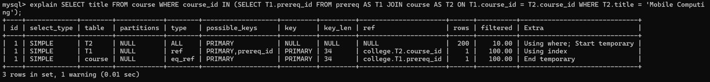
Id相同，按照顺序，先查询T2，用到了条件过滤，临时表，再查询T1,用到索引查询，最后查询course，用到临时表。

```sql
explain analyze SELECT title FROM course WHERE course_id IN 
(SELECT T1.prereq_id FROM prereq AS T1 
JOIN course AS T2 ON T1.course_id = T2.course_id 
WHERE T2.title = 'Mobile Computing');
```
```sql
explain analyze SELECT title FROM course WHERE course_id IN 
(SELECT T1.prereq_id FROM prereq AS T1 
JOIN course AS T2 ON T1.course_id = T2.course_id 
WHERE T2.title = 'Mobile Computing');
```
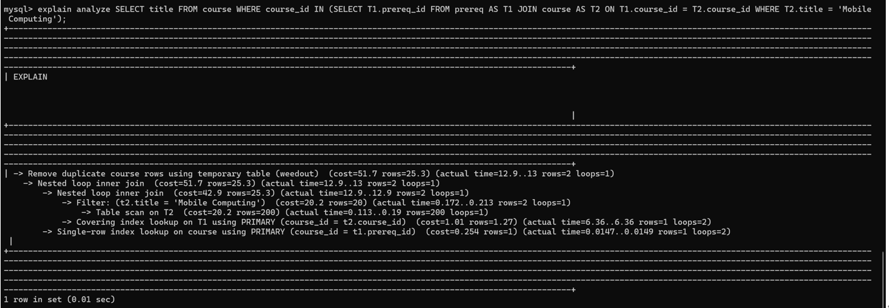
图片按照下面这个顺序执行的
1.-> Table scan on T2 	
2.-> Filter: (t2.title = 'Mobile Computing')
第一步扫描T2全表并立刻过滤筛出t2.title = 'Mobile Computing’
3.-> Covering index lookup on T1 using PRIMARY (course_id = t2.course_id)
使用PRIMARY索引在T1表中查找与T2.course_id匹配的行。这一步是嵌套循环的一部分
4.-> Nested loop inner join 
将T2和T1通过嵌套循环连接
5.-> Single-row index lookup on course using PRIMARY (course_id = t1.prereq_id)
再次通过PRIMARY索引在course表中查找与T1.process_id匹配的行。这一步可能是关联子查询的最终结果
6.-> Nested loop inner join
再次执行嵌套循环连接，将上一步的结果与主查询关联。这里in使用嵌套内连接，因为外层表数据量小
7.-> Remove duplicate course rows using temporary table (weedout)
通过临时表去重，确保结果唯一

##### 4.执行一下语句，获取并解释该查询的执行计划：
```sql
explain SELECT dept_name, building FROM department WHERE budget > (SELECT avg(budget) FROM department);
```
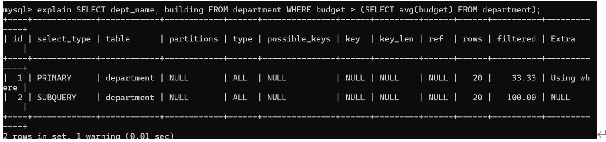
Id不同，从大到小执行，id=2进行子查询，未使用索引查询，id=1主查询，未使用索引查询，使用条件查询
```sql
explain analyze SELECT dept_name, building FROM department WHERE budget > (SELECT avg(budget) FROM department);
```
```sql
explain analyze SELECT dept_name, building FROM department WHERE budget > (SELECT avg(budget) FROM department);
```
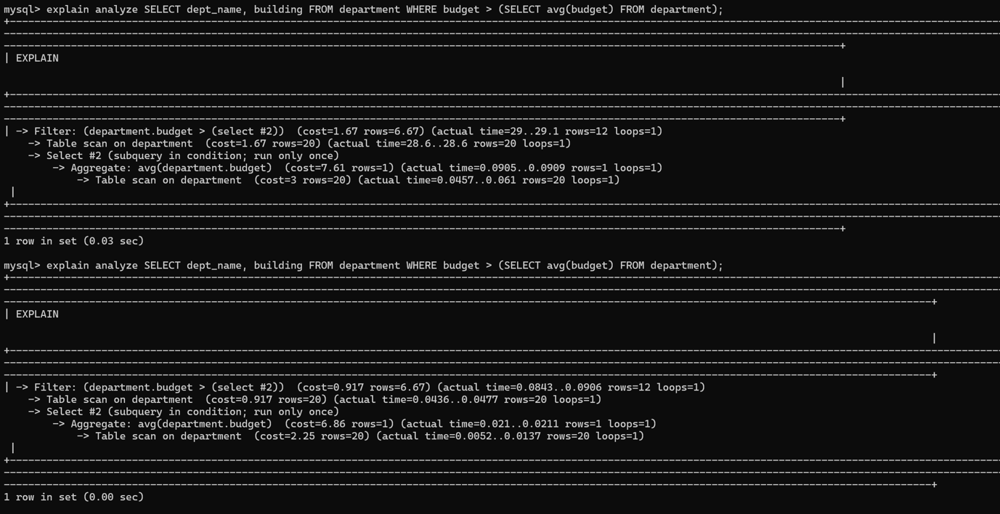
图片给出执行所耗时间及返回行数和循环次数，并按照下面顺序执行：
1.	Table scan on department
对 department 表进行全表扫描，获取所有数据
2.	Aggregate: avg(department.budget) 
计算department中budget的平均值
3.	Select #2 (subquery in condition; run only once)
   表示子查询仅执行一次，结果入缓存重复使用，可以优化时间
4.	Table scan on department
5.	 Filter: (department.budget > (select #2)) 
扫描全表，并过滤筛出budget > (SELECT AVG(budget) FROM department)

#### 步骤3
对实验2中的小项目作业中涉及的SQL查询语句，使用EXPLAN语句进行分析： 
1. 画出查询计划树，说明每个节点的功能和执行时间信息 
2. 说明该执行计划是否为最优的 
3. 针对可能出现的性能问题，提出解决方案。（若为最优的，尝试做一个较差的执行方案并说明性能差距出现的原因
```sql
explain select * from student where name like ?
```
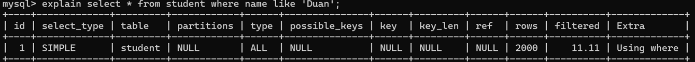
查询计划树为
-> Filter: (student.`name` like 'Duan')  (cost=202 rows=222)
过滤筛选出student表中的name 为’Duan’
-> Table scan on student  (cost=202 rows=2000)
扫描student表
不是最优，查询type为ALL，效率最低，应当为name列建立索引，这样可以避免全表扫描，直接通过索引定位name为’Duan‘
```sql
explain select * from student where id = ?
```
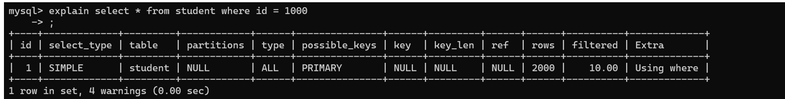
查询计划树为
-> Filter: (student.ID = 1000)  (cost=202 rows=200)
过滤筛选出id为1000的一行
    -> Table scan on student  (cost=202 rows=2000)
扫描全表
不是最优的，可以为id建立索引，通过索引直接定位到id为1000的student信息，减少查询时间
```sql
explain　select t.course_id,t.year,t.semester,
c.title,c.dept_name,t.grade,c.credits 
FROM takes t JOIN course c ON t.course_id =c.course_id WHERE t.id = ？
```
查询计划树为
 -> Nested loop inner join  (cost=4147 rows=3000)
循环内连接，将c与t相连
    -> Filter: (t.ID = 1000)  (cost=3097 rows=3000)
过滤筛选出表t中ID为1000的一行
        -> Table scan on t  (cost=3097 rows=30000)
扫描表t
    -> Single-row index lookup on c using PRIMARY (course_id = t.course_id)  		(cost=0.25 rows=1)
通过主键关联（PRIMARY），确保每个 course_id 在表 c 中唯一匹配一行
在查询表t时候可以为id建索引，这样可以加快查询速率，要想降低速率，可以删除c	表中id的主键索引


### 存在的问题及解决方案
对实验2中的小项目作业中涉及的SQL查询语句，使用EXPLAN语句进行分析有些困难，因为涉及到多个表的关联查询，需要对每个表的索引进行分析，并且需要考虑到查询计划树的结构。

### 实验结论
通过查阅资料，我学会了mysql explain语句及其返回结果，并学会解释计划查询，还掌握了如何画查询计划树，实验过程有些困难，但最终都被解决。